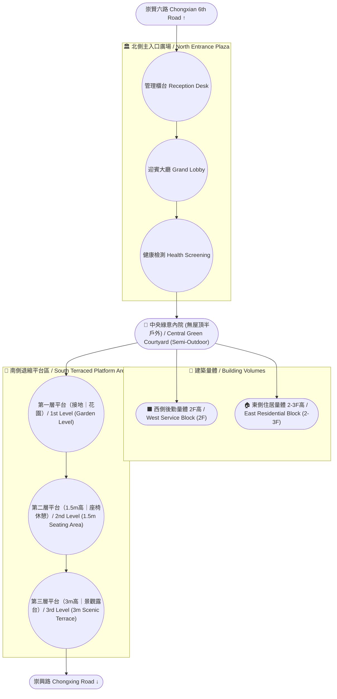

```mermaid
flowchart TB
    崇賢六路([崇賢六路 Chongxian 6th Road ↑])

    subgraph north_entrance [🏛️ 北側主入口廣場 / North Entrance Plaza]
      reception((管理櫃台 Reception Desk))
      lobby((迎賓大廳 Grand Lobby))
      health_check((健康檢測 Health Screening))
    end

    central_courtyard(["🌳 中央綠意內院 (無屋頂半戶外) / Central Green Courtyard (Semi-Outdoor)"])

    subgraph building_volumes [🏢 建築量體 / Building Volumes]
      west_service(["⬛ 西側後勤量體 2F高 / West Service Block (2F)"])
      east_residence(["🏠 東側住居量體 2-3F高 / East Residential Block (2-3F)"])
    end

    subgraph south_terrace [🌿 南側退縮平台區 / South Terraced Platform Area]
      platform1(("第一層平台（接地｜花園）/ 1st Level (Garden Level)"))
      platform2(("第二層平台（1.5m高｜座椅休憩）/ 2nd Level (1.5m Seating Area)"))
      platform3(("第三層平台（3m高｜景觀露台）/ 3rd Level (3m Scenic Terrace)"))
    end

    崇興路([崇興路 Chongxing Road ↓])

    崇賢六路 --> reception --> lobby --> health_check --> central_courtyard
    central_courtyard --> west_service
    central_courtyard --> east_residence
    central_courtyard --> platform1
    platform1 --> platform2 --> platform3 --> 崇興路
```
